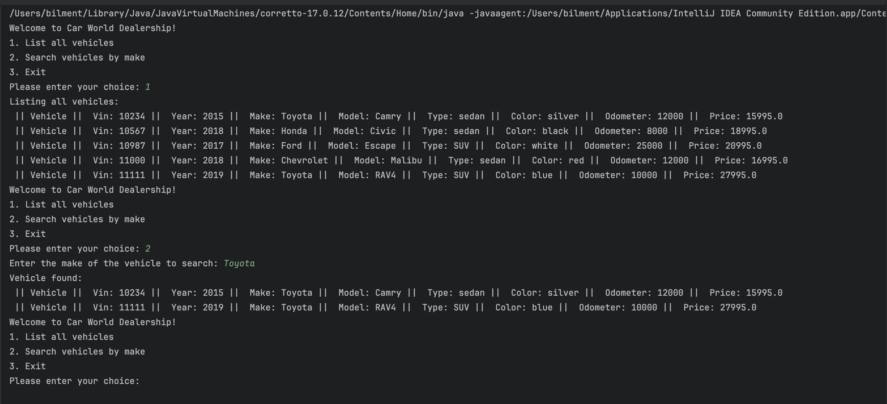

# Project Title

## Description of the Project

The Car Dealership Management System is a simple Java program that helps manage a car dealerships inventory. 
Users can add new cars, view all available cars, and search for cars by make like Honda or Ford. 
This program uses a CSV file to store all car information, so it’s easy to update and retrieve car details.

## User Stories

List the user stories that guided the development of your application. Format these stories as: "As a [type of user], I want [some goal] so that [some reason]."

- As a dealership manager, I want to add new cars to the inventory so that the list of cars stays current.
- As a salesperson, I want to search for cars by make so that I can find cars that match customer needs quickly.
- As a dealership employee, I want to see all cars in the inventory so that I can help customers find options.
 -As a developer, I want the program to handle errors smoothly so that it runs without issues, even if there’s incorrect data.

## Setup

Instructions on how to set up and run the project using IntelliJ IDEA.

### Prerequisites

- IntelliJ IDEA: Ensure you have IntelliJ IDEA installed, which you can download from [here](https://www.jetbrains.com/idea/download/).
- Java SDK: Make sure Java SDK is installed and configured in IntelliJ.

### Running the Application in IntelliJ

Follow these steps to get your application running within IntelliJ IDEA:

1. Open IntelliJ IDEA.
2. Select "Open" and navigate to the directory where you cloned or downloaded the project.
3. After the project opens, wait for IntelliJ to index the files and set up the project.
4. Locate the Program class with the public static void main(String[] args) method.
5. Right-click on the Program class and select 'Run' to start the application.

## Technologies Used

- Java: Mention the version you are using.
- Any additional libraries or frameworks used in the project.

## Demo

- Running 

## Future Work

Outline potential future enhancements or functionalities you might consider adding:

- Adding vehicle filtering options based on price, mileage, or year. 
- Implementing a graphical user interface (GUI) for an enhanced user experience.

## Resources

List resources such as tutorials, articles, or documentation that helped you during the project.

- https://yearup.brightspace.com/d2l/home
- https://www.w3schools.com/java/

## Team Members

- **Name 1** - Taha Bilmen

## Thanks

Express gratitude towards those who provided help, guidance, or resources:

- Thank you to Raymond for continuous support and guidance.
- A special thanks to all teammates for their dedication and teamwork.